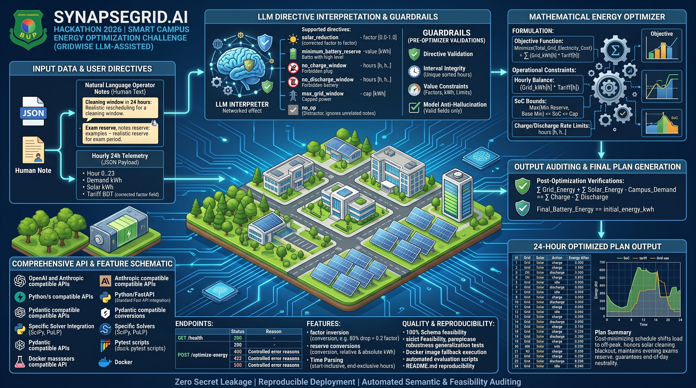

<div align="center">

# SynapseGrid.ai — Smart Campus Energy Optimization Challenge



</div>

LLM-assisted operator directive interpretation + deterministic energy
optimization, built for the BUP CSE FEST 2026 preliminary round
("GridWise" is the organizers' name for this challenge track;
SynapseGrid.ai is our submission's name for the service implementing it).


---

## 🌐 Live Deployment & Interactive Demo

The service is deployed live on Render with automated HTTPS, continuous integration, and OpenAPI Swagger documentation:

* **Interactive API Docs (Swagger UI):** [https://menofculture-synapsegrid-ai.onrender.com/docs](https://menofculture-synapsegrid-ai.onrender.com/docs)
* **Alternative Documentation (ReDoc):** [https://menofculture-synapsegrid-ai.onrender.com/redoc](https://menofculture-synapsegrid-ai.onrender.com/redoc)
* **Service Health Check:** [https://menofculture-synapsegrid-ai.onrender.com/health](https://menofculture-synapsegrid-ai.onrender.com/health)

> ⚠️ **Note for Evaluators:** Hosted on Render Cloud. If the instance has been idle, the initial cold start may take ~30–45 seconds to spin up. Subsequent calls execute in under 2 seconds.

---

### Quick Test Options

#### Option 1: Browser via Swagger UI (Zero Setup)
1. Open [https://menofculture-synapsegrid-ai.onrender.com/docs](https://menofculture-synapsegrid-ai.onrender.com/docs).
2. Click on **`POST /optimize-energy`** and select **"Try it out"**.
3. Paste the sample payload provided below into the **Request body** field.
4. Click **Execute** to view the live optimization results, directive classifications, and cost breakdown.

#### Option 2: Direct cURL via Terminal
Run this command in any terminal to test the live production API:

```bash
curl -X POST [https://menofculture-synapsegrid-ai.onrender.com/optimize-energy](https://menofculture-synapsegrid-ai.onrender.com/optimize-energy) \
  -H "Content-Type: application/json" \
  -d '{
    "scenario_id": "LIVE-DEMO-01",
    "operator_notes": [
      "Solar output will drop to about 25% from 12:00 to 14:00 due to cleaning.",
      "Cafeteria menu updates for tomorrow."
    ],
    "hours": [
      {"hour": 0, "demand_kwh": 90, "solar_kwh": 0, "tariff_bdt_per_kwh": 6},
      {"hour": 1, "demand_kwh": 85, "solar_kwh": 0, "tariff_bdt_per_kwh": 6},
      {"hour": 2, "demand_kwh": 80, "solar_kwh": 0, "tariff_bdt_per_kwh": 5},
      {"hour": 3, "demand_kwh": 80, "solar_kwh": 0, "tariff_bdt_per_kwh": 5},
      {"hour": 4, "demand_kwh": 85, "solar_kwh": 0, "tariff_bdt_per_kwh": 5},
      {"hour": 5, "demand_kwh": 95, "solar_kwh": 0, "tariff_bdt_per_kwh": 6},
      {"hour": 6, "demand_kwh": 110, "solar_kwh": 5, "tariff_bdt_per_kwh": 8},
      {"hour": 7, "demand_kwh": 130, "solar_kwh": 20, "tariff_bdt_per_kwh": 10},
      {"hour": 8, "demand_kwh": 150, "solar_kwh": 50, "tariff_bdt_per_kwh": 12},
      {"hour": 9, "demand_kwh": 165, "solar_kwh": 90, "tariff_bdt_per_kwh": 14},
      {"hour": 10, "demand_kwh": 175, "solar_kwh": 130, "tariff_bdt_per_kwh": 16},
      {"hour": 11, "demand_kwh": 180, "solar_kwh": 160, "tariff_bdt_per_kwh": 16},
      {"hour": 12, "demand_kwh": 185, "solar_kwh": 180, "tariff_bdt_per_kwh": 15},
      {"hour": 13, "demand_kwh": 180, "solar_kwh": 170, "tariff_bdt_per_kwh": 14},
      {"hour": 14, "demand_kwh": 170, "solar_kwh": 140, "tariff_bdt_per_kwh": 13},
      {"hour": 15, "demand_kwh": 165, "solar_kwh": 90, "tariff_bdt_per_kwh": 14},
      {"hour": 16, "demand_kwh": 170, "solar_kwh": 45, "tariff_bdt_per_kwh": 18},
      {"hour": 17, "demand_kwh": 185, "solar_kwh": 10, "tariff_bdt_per_kwh": 22},
      {"hour": 18, "demand_kwh": 205, "solar_kwh": 0, "tariff_bdt_per_kwh": 28},
      {"hour": 19, "demand_kwh": 215, "solar_kwh": 0, "tariff_bdt_per_kwh": 30},
      {"hour": 20, "demand_kwh": 205, "solar_kwh": 0, "tariff_bdt_per_kwh": 26},
      {"hour": 21, "demand_kwh": 175, "solar_kwh": 0, "tariff_bdt_per_kwh": 18},
      {"hour": 22, "demand_kwh": 135, "solar_kwh": 0, "tariff_bdt_per_kwh": 10},
      {"hour": 23, "demand_kwh": 105, "solar_kwh": 0, "tariff_bdt_per_kwh": 7}
    ],
    "battery": {
      "capacity_kwh": 220,
      "initial_energy_kwh": 110,
      "minimum_energy_kwh": 40,
      "max_charge_kwh_per_hour": 50,
      "max_discharge_kwh_per_hour": 50
    }
  }'

Pipeline (matches the problem statement's architecture exactly):

```
Operator Notes + 24h Scenario
        |
        v
DirectiveInterpreter (ml/interpreter.py)
    -> LLM provider (ml/providers.py)         [natural language -> raw JSON]
    -> deterministic validator (ml/validator.py) [untrusted JSON -> safe directives]
    -> retry-with-correction on failure (ml/prompts.py: build_correction_prompt)
        |
        v
Validated DirectiveInterpretation list
        |
        v
optimizer/constraints.py   [directives -> per-hour arrays]
optimizer/optimizer.py     [linear program -> hourly_plan]  <- NO LLM involvement
        |
        v
optimizer/final_validator.py  [replay hourly_plan against every rule/directive]
        |
        v
HTTP JSON response (app/routes.py)
```

The LLM never computes a schedule, cost, or any numeric optimization
result — it only turns natural language into one of six structured
directives, which deterministic code then validates, applies, and
optimizes.

## Project layout

```
app/            FastAPI service: routes, request/response schemas, config
ml/             LLM interpretation layer (the ML module)
  schemas.py        Pydantic contract for directives (strict validation)
  prompts.py        System prompt, few-shot examples, prompt builders
  providers.py      LLMProvider abstraction: OpenAI / Anthropic / offline mock
  interpreter.py    Orchestrates LLM call -> parse -> validate -> retry
  validator.py      Deterministic guardrail (never trusts raw LLM output)
  normalizer.py     Regex-based time/percentage parsing (backs the mock
                     provider + pins down semantics in tests)
  exceptions.py     Controlled error types
optimizer/      Deterministic math layer (LLM-free)
  constraints.py    Directives + scenario -> per-hour arrays
  optimizer.py      Linear program (scipy/HiGHS) -> hourly_plan
  cost.py           total_grid_kwh / total_cost_bdt / peak_grid_kwh
  final_validator.py  Replays hourly_plan against every SynapseGrid.ai rule
tests/          pytest suite (68 tests)
scripts/        scripts/evaluate_interpreter.py — accuracy metrics
docs/           Public sample cases JSON (the reference PDFs are kept locally,
                gitignored, and are not read by any code)
Dockerfile, docker-compose.yml, .dockerignore   Container build/run setup
requirements.txt        Runtime dependencies (what the Docker image installs)
requirements-dev.txt    Adds pytest + httpx for running the tests
.env.example            All supported environment variables
```

## How the ML pipeline works

1. **`DirectiveInterpreter.interpret()`** builds one prompt for *all* of a
   scenario's 1-3 operator notes (Section 26: one request per scenario, not
   per note) and calls the configured `LLMProvider.generate_structured()`.
2. The raw text response is parsed defensively (tolerates markdown code
   fences, `{"directive_interpretation": [...]}` or a bare `[...]`).
3. **`validate_interpretation()`** deterministically checks every rule from
   the problem statement's guardrail table: allowed directive types, full
   note coverage with no duplicates, ascending/unique/in-range hours,
   `factor` in `[0,1]`, non-negative finite reserve/grid-cap values, reserve
   not exceeding battery capacity, `no_op` <-> `applies=false` <-> `null`
   adjustment, and rejection of any extra/invented field in
   `structured_adjustment` (via Pydantic's `extra="forbid"`).
4. If validation fails, a **correction prompt** containing only the
   validation errors is sent back to the model (`MAX_RETRIES`, default 1).
5. If validation still fails after all retries, the service **fails safe**:
   every note is returned as `no_op` (never a guess, never a crash) unless
   `on_unsafe_fallback="raise"` is configured, in which case a controlled
   `InterpretationValidationError` propagates instead. The same fail-safe
   applies if the LLM call exceeds `LLM_TIMEOUT_SECONDS` (default 20):
   `DirectiveInterpreter.interpret_async()` runs the blocking LLM call in a
   worker thread, so a slow or hung provider neither freezes the server for
   other requests nor holds a request open indefinitely.
6. Only now does `optimizer/optimizer.py` run — a linear program (via
   `scipy.optimize.linprog`, HiGHS) with variables `grid`, `solar_used`,
   `charge`, `discharge`, `battery_energy_after` per hour, minimizing
   `sum(grid[h] * tariff[h])` subject to the energy-balance equation,
   battery bounds/rate limits, and every applied directive.
7. `optimizer/final_validator.py` independently replays the resulting
   `hourly_plan` hour-by-hour (its own copy of the rules, not shared code
   paths with the LP) as a safety net before the response is returned.

### The six supported directives

`solar_reduction`, `minimum_battery_reserve`, `no_charge_window`,
`no_discharge_window`, `max_grid_window`, `no_op` — see `ml/prompts.py`
for the exact schema and semantics embedded in the system prompt, and
`ml/schemas.py` for their Pydantic models.

## How to configure the LLM

Copy `.env.example` to `.env` and set:

```
MODEL_PROVIDER=openai        # or anthropic, or mock
MODEL_NAME=gpt-4o-mini        # or e.g. claude-sonnet-5 for anthropic
API_KEY=sk-...                 # never hard-coded, never committed
MAX_RETRIES=1                  # correction retries after a failed validation
LLM_TIMEOUT_SECONDS=20         # wall-clock budget for the whole LLM step
LOG_LEVEL=INFO
```

`API_BASE_URL` is optional (OpenAI-compatible proxy). `PORT` is read by the
Docker image (default 8000) and is normally injected by the hosting platform.

- `openai` / `anthropic` use the respective official SDKs with JSON-mode /
  plain text completion and `temperature=0`.
- `mock` is a **deterministic, offline, rule-based** provider
  (`ml/providers.py: MockProvider`, backed by `ml/normalizer.py`) used as
  the default so the project runs and tests pass with zero credentials.
  **It does not satisfy the competition's "LLM must be part of the
  interpretation path" requirement** — set `MODEL_PROVIDER` to `openai` or
  `anthropic` before deploying/submitting.
- Swapping providers never touches application code — `app/routes.py` only
  calls `provider.generate_structured(...)` through the `LLMProvider`
  abstract base class.

## How to run the server

```bash
python3 -m venv .venv && source .venv/bin/activate
pip install -r requirements.txt
cp .env.example .env        # then edit MODEL_PROVIDER / MODEL_NAME / API_KEY
uvicorn app.main:app --host 0.0.0.0 --port 8000
```

| Endpoint | Purpose |
|---|---|
| `GET /health` | Liveness check → `{"status": "ok"}` |
| `POST /optimize-energy` | Main API: scenario + operator notes in, schedule out. See `app/schemas.py` / Section 07 of the problem statement for the request shape |
| `GET /optimize-energy` | Browser-friendly usage message (browsers send GET; the real endpoint is POST) |
| `GET /docs` | Swagger UI — paste a scenario, click **Try it out** → **Execute** (pre-filled with a sample case) |

`POST /optimize-energy` status codes: `200` success; `400` malformed JSON or
an invalid request (missing fields, not exactly 24 distinct hours 0-23, 0 or
more than 3 notes, battery bounds violated); `422` scenario infeasible under
the directives; `500` interpretation/optimizer/final-validation failure (no
stack traces are ever returned).

Open the service in a browser at `http://localhost:8000/docs` — note that
`0.0.0.0` is only a bind address and cannot be opened in a browser.

## Running with Docker

The service is fully containerized (`Dockerfile` + `docker-compose.yml`).
The image installs `requirements.txt`, copies only `app/`, `ml/`,
`optimizer/`, `scripts/`, and the public sample-case JSON (tests, docs
PDFs, and the venv are excluded via `.dockerignore`), and runs as a
non-root user with a built-in `HEALTHCHECK` against `/health`.

```bash
cp .env.example .env        # edit MODEL_PROVIDER / MODEL_NAME / API_KEY first

# Option A: docker compose (recommended — reads .env automatically)
docker compose up --build

# Option B: plain docker
docker build -t synapsegrid-energy-optimizer .
docker run --rm -p 8000:8000 --env-file .env synapsegrid-energy-optimizer
```

Test it and publish to Docker Hub (replace `<dockerhub-username>` and the
version tag):

```bash
curl http://localhost:8000/health        # -> {"status":"ok"}

docker login
docker tag  synapsegrid-energy-optimizer <dockerhub-username>/synapsegrid-energy-optimizer:1.0.0
docker push <dockerhub-username>/synapsegrid-energy-optimizer:1.0.0
```

Then the same `curl` calls from the section above work against
`http://localhost:8000`. `docker compose up -d` runs it detached;
`docker compose logs -f` follows the structured request logs described
below.

Notes:

- `MODEL_PROVIDER=mock` (the `.env.example` default) needs no `API_KEY` and
  is fine for confirming the container runs end-to-end; switch to `openai`
  or `anthropic` with a real key before deploying/submitting, same as the
  non-Docker path.
- The image has been built and run locally: `GET /health` returns
  `{"status":"ok"}`, `POST /optimize-energy` matches the sample-case cost,
  it runs as a non-root user, and it honours the `PORT` env var that
  Render/Railway inject (`docker run -e PORT=9000 -p 9000:9000 ...`). The
  server binds `0.0.0.0`; no `.env` or secrets are baked into the image, so
  pass them at run time (`--env-file .env` or the platform's env settings).
- The Dockerfile deliberately has no `# syntax=docker/dockerfile:1` line: it
  makes BuildKit download an extra frontend image from Docker Hub first,
  which can stall on slow networks, and nothing here needs it.
- If `docker pull python:3.12-slim` itself hangs, that is a Docker Hub /
  network issue, not the project. Pull through a mirror and re-tag:
  `docker pull mirror.gcr.io/library/python:3.12-slim && docker tag mirror.gcr.io/library/python:3.12-slim python:3.12-slim`
- Rebuild after dependency changes (`docker compose up --build`); code-only
  changes under `app/`, `ml/`, `optimizer/` also need a rebuild since the
  image copies source rather than mounting it. For live-reload local dev,
  run `uvicorn app.main:app --reload` outside Docker instead.

## Deploying to Render

Render builds straight from the `Dockerfile` in this GitHub repo.

1. [render.com](https://render.com) → **New +** → **Web Service** → connect
   the GitHub repo.
2. **Language:** Docker. **Branch:** the branch that has the latest code.
   Leave *Root Directory* empty.
3. **Advanced → Health Check Path:** `/health`.
4. **Environment Variables** (secrets live here, never in git):

   | Key | Value |
   |---|---|
   | `MODEL_PROVIDER` | `openai` (required — `mock` does not satisfy the LLM requirement) |
   | `API_KEY` | your OpenAI key (required) |
   | `MODEL_NAME` | `gpt-4o-mini` |
   | `MAX_RETRIES` | `1` |
   | `LLM_TIMEOUT_SECONDS` | `20` |

   Do **not** set `PORT` — Render injects it and the image's `CMD` reads it.
5. **Create Web Service**, wait for "Your service is live", then check
   `https://<your-service>.onrender.com/health` and
   `https://<your-service>.onrender.com/docs`.

Free-tier services sleep after ~15 minutes idle and take 30-60 s to wake on
the next request; use a paid instance (or a periodic `/health` ping) when
response time matters. Every push to the deployed branch redeploys
automatically.

## How to run tests

`pytest` and `httpx` are test-only and live in `requirements-dev.txt`
(kept out of `requirements.txt`/the Docker image, which only need runtime
deps):

```bash
source .venv/bin/activate
pip install -r requirements-dev.txt
python -m pytest tests/ -v
```

All 68 tests run against the offline `mock` provider (no network/API key
needed) and currently pass, including:

- `test_time_parsing.py` / `test_numeric_parsing.py` — start-inclusive/
  end-exclusive hour semantics, "remaining fraction" vs. "reduction"
  percentage semantics.
- `test_validator.py` — every deterministic guardrail rule, including
  malformed/hallucinated input that must not crash the validator.
- `test_interpreter.py` — one test per directive type, three independent
  paraphrases of the same solar-reduction note (Section 17), five
  adversarial notes that must never hallucinate scenario data or invent
  directives (Section 18), and the retry/safe-fallback path (Section 22-23).
- `test_public_cases.py` — runs all 10 public sample cases through the
  *entire* pipeline (interpret -> optimize -> final-validate) and checks
  schedule validity (24 hours, energy balance, battery bounds, end-of-day
  neutrality, directive constraints) without hard-coding any case's
  expected numbers.

To evaluate interpretation *accuracy* specifically (relevance, directive
classification, hour/numeric extraction, no_op, complete-interpretation
accuracy, plus an error-kind breakdown):

```bash
python scripts/evaluate_interpreter.py
# or against another labeled pack:
python scripts/evaluate_interpreter.py --cases path/to/cases.json
```

This respects the same `MODEL_PROVIDER` env var, so pointing it at a real
LLM gives a true accuracy readout before submission.

## How to test /optimize-energy manually

```bash
uvicorn app.main:app --port 8000 &
curl -s http://127.0.0.1:8000/health

curl -s -X POST http://127.0.0.1:8000/optimize-energy \
  -H "Content-Type: application/json" \
  -d '{
    "scenario_id": "DEMO-1",
    "operator_notes": [
      "Solar output will drop to about 20% from 1 PM to 3 PM.",
      "Do not charge the battery between 2 AM and 4 AM."
    ],
    "hours": [ ... 24 entries with hour/demand_kwh/solar_kwh/tariff_bdt_per_kwh ... ],
    "battery": {
      "capacity_kwh": 500, "initial_energy_kwh": 200, "minimum_energy_kwh": 50,
      "max_charge_kwh_per_hour": 100, "max_discharge_kwh_per_hour": 100
    }
  }' | python3 -m json.tool
```

Or replay the whole public sample pack (`httpx` comes with
`requirements-dev.txt`; point the URL at a deployed service to test that
instead):

```bash
python3 -c "
import json, httpx
data = json.load(open('docs/BUP_CSE_FEST_2026_Preli_Public_Sample_Cases.json'))
for case in data['cases']:
    r = httpx.post('http://127.0.0.1:8000/optimize-energy', json=case['input'], timeout=60)
    print(case['id'], r.status_code, r.json()['total_cost_bdt'], 'expected', case['expected_output']['total_cost_bdt'])
"
```

PowerShell (Windows), sending one case from a JSON file:

```powershell
$body = (Get-Content docs\BUP_CSE_FEST_2026_Preli_Public_Sample_Cases.json -Raw | ConvertFrom-Json).cases[0].input | ConvertTo-Json -Depth 10
Invoke-RestMethod -Method Post -Uri http://127.0.0.1:8000/optimize-energy -ContentType "application/json" -Body $body
```

The request body must be the scenario object itself (`scenario_id`,
`operator_notes`, `hours`, `battery` at the top level) — not a whole sample
case entry and not wrapped in another key.

## Known limitations

- The `mock` provider is a hand-written regex engine, not a real language
  model. It reaches 100% accuracy on the 10 public sample cases (see
  `scripts/evaluate_interpreter.py` output) but will not generalize to
  arbitrary hidden paraphrasing the way a real LLM will — it exists purely
  so the project is runnable/testable without credentials. **A real
  provider must be configured for actual grading.**
- The safe-fallback path (`on_unsafe_fallback="fallback"`, the default)
  degrades an unrecoverable interpretation failure to "apply nothing"
  (`no_op` for every note) rather than failing the whole request with a
  5xx. This maximizes uptime/availability but means a genuinely
  misbehaving LLM silently loses directives instead of erroring loudly;
  every occurrence is logged at `WARNING` (`interpretation_fallback`) for
  observability. Set `on_unsafe_fallback="raise"` in `app/routes.py` if a
  hard failure (HTTP 500) is preferred instead.
- Directives of the same type that overlap in an hour are combined as
  follows: `solar_reduction` factors **multiply** (0.5 and 0.5 give 0.25),
  `minimum_battery_reserve` takes the **max**, and `max_grid_window` takes
  the **min** (tightest cap wins). The problem statement guarantees
  organizer scenarios won't require contradictory hard directives, so
  contradictory overlaps shouldn't arise in valid scoring scenarios.
- On timeout the LLM worker thread cannot be forcibly killed (a Python
  limitation): the request returns promptly with the no_op fallback, but the
  abandoned provider call finishes in the background.
- The optimizer solves an exact LP to global optimality (not a heuristic),
  so cost-minimization is provably optimal given the validated directives —
  the only source of suboptimality is misinterpretation upstream.
- `plan_summary` is generated by a simple deterministic template, not the
  LLM, since Section 02 explicitly says using an LLM only for
  `plan_summary`/cosmetic text does not satisfy the LLM requirement — the
  LLM's real job (directive interpretation) already satisfies it.

## Next improvements

- Add a small in-process cache keyed on `(scenario_id, notes)` to avoid
  redundant LLM calls if the judge harness ever retries a request.
- Expand `MockProvider`'s regex coverage (or replace it with a tiny local
  transformer) if a fully offline fallback for production is ever desired.
- Add OpenTelemetry-style structured JSON logging (currently plain
  `logging` text) if downstream log aggregation is needed.
- Add a request-level rate limiter (the LLM call already has a timeout,
  `LLM_TIMEOUT_SECONDS`).

<br>

---

  ## Team & Contributors

* **Sayem Rahman** ([@SayemR0018](https://github.com/SayemR0018)) — **Team Lead**
  * Overall system architecture design and project roadmap orchestration.
  * API contract enforcement, end-to-end integration across ML and optimization modules.
  * Benchmark evaluation against official competition rubrics, documentation, and presentation walkthrough.
* **Rabbi Islam Emon** ([@iamrabbiislamemon](https://github.com/iamrabbiislamemon)) — **Initial Codebase & Backend Engineering**
  * Core repository scaffolding, application layout, and environment configuration management.
  * FastAPI service initialization (`app/main.py`, `app/routes.py`, `app/schemas.py`).
  * Initial mathematical formulation setup and baseline endpoint routing.
* **MD. Redwan Hossain Khan** ([@redwan212](https://github.com/redwan212)) — **ML Model & LLM Directive Interpretation**
  * LLM provider abstraction layer (`ml/providers.py`) supporting OpenAI, Anthropic, and offline mock engines.
  * Prompt engineering with Pydantic structured outputs (`ml/prompts.py`) and zero-shot distractor rejection (`no_op`).
  * Time normalization (start-inclusive, end-exclusive hours) and factor inversion parsing (`ml/normalizer.py`).
* **Shamiul Riyad** ([@shamiulriyad](https://github.com/shamiulriyad)) — **Docker Deployment & Guardrail Engineering**
  * Pre-optimization deterministic guardrails (`ml/validator.py`) to eliminate hallucinations and invalid inputs.
  * Post-optimization schedule verification replayer (`optimizer/final_validator.py`) auditing energy balance and neutrality.
  * Multi-stage Docker containerization (`Dockerfile`, `docker-compose.yml`), non-root security, and registry publishing.

---


  
